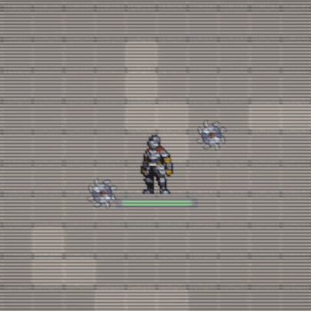
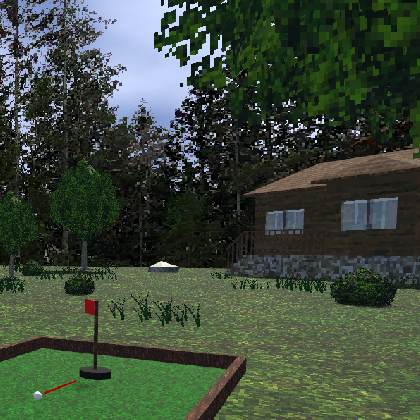
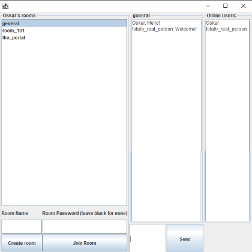
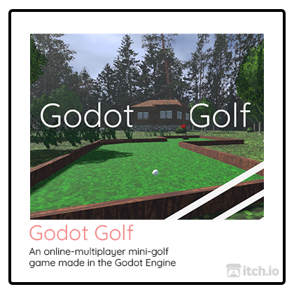

  <h1>Well met! I'm Oskar Norberg</h1>
  <h4>I'm an aspring game programmer with an interest in low-level graphics programming and tool-development</h3>

💬 Currently:
<ul>
  <li>Studying game programming at Futuregames.</li>
  <li>Developing a <a href="https://github.com/Oskar-Norberg/DiegeticMainMenu">Diegetic Main Menu Unity package</a> for quick prototyping of main menus.</li>
</ul>

  
<b>Some projects I've been working on:</b>

  
  
   
  
  

 

<b>Languages and Tools:</b> 

  

 

  <i>Yes, I use perforce changelog conventions on my commits. No, you cannot stop me. 🙃</i>

