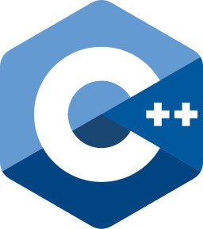

  <h1>Well met! I'm Oskar Norberg</h1>
  <h4>I'm an aspring game programmer with an interest in low-level graphics programming and tool-development</h3>

💬 Currently:
- Learning graphics programming using OpenGL.
- Working on my game <a href="https://github.com/Oskar-Norberg/Godot-Golf">Godot-Golf</a>.

  
<b>Let me show you what I've been working on:</b>

  
  

 

<b>Languages and Tools:</b> 

  
  
  
  
  
  

