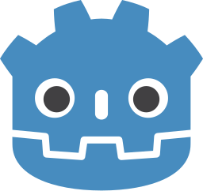

  <h1>Well met! I'm Oskar Norberg</h1>
  <h4>I'm an aspring game programmer with an interest in low-level graphics programming and tool-development</h3>

💬 Currently:
<ul>
  <li>Learning graphics and shader programming using OpenGL.</li>
  <li> Working on my game <a href="https://github.com/Oskar-Norberg/Godot-Golf">Godot-Golf</a>, check it out on <a href="https://oskar-norberg.itch.io/godot-golf">itch.io</a>!</li>
</ul>

  
<b>Some projects I've been working on:</b>

  
  

 

<b>Languages and Tools:</b> 

  
  
  
  
  
  
  

